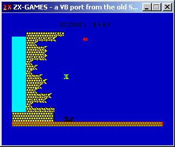



## ZX\-GAMES

### Description

Have you ever had a ZX-Spectrum??? then you should remember some of these games... i wrote this simple app to all these nostalgic people out there... and also for me! Simple and complete games in 100~150 lines of code each one! it is also easily extensible so you can add your own games if you have the source... forget VB! connect your PC speaker and return to the old and plain Basic language!!!
 
### More Info
 

             |
---                |---
**Submitted On**   |2002-09-28 11:41:22
**By**             |[gonchuki\_](https://github.com/Planet-Source-Code/PSCIndex/blob/master/ByAuthor/gonchuki.md)
**Level**          |Intermediate
**User Rating**    |4.7 (90 globes from 19 users)
**Compatibility**  |VB 5\.0, VB 6\.0
**Category**       |[Games](https://github.com/Planet-Source-Code/PSCIndex/blob/master/ByCategory/games__1-38.md)
**World**          |[Visual Basic](https://github.com/Planet-Source-Code/PSCIndex/blob/master/ByWorld/visual-basic.md)
**Archive File**   |[ZX\-GAMES1393651012002\.zip](https://github.com/Planet-Source-Code/gonchuki-zx-games__1-39434/archive/master.zip)

